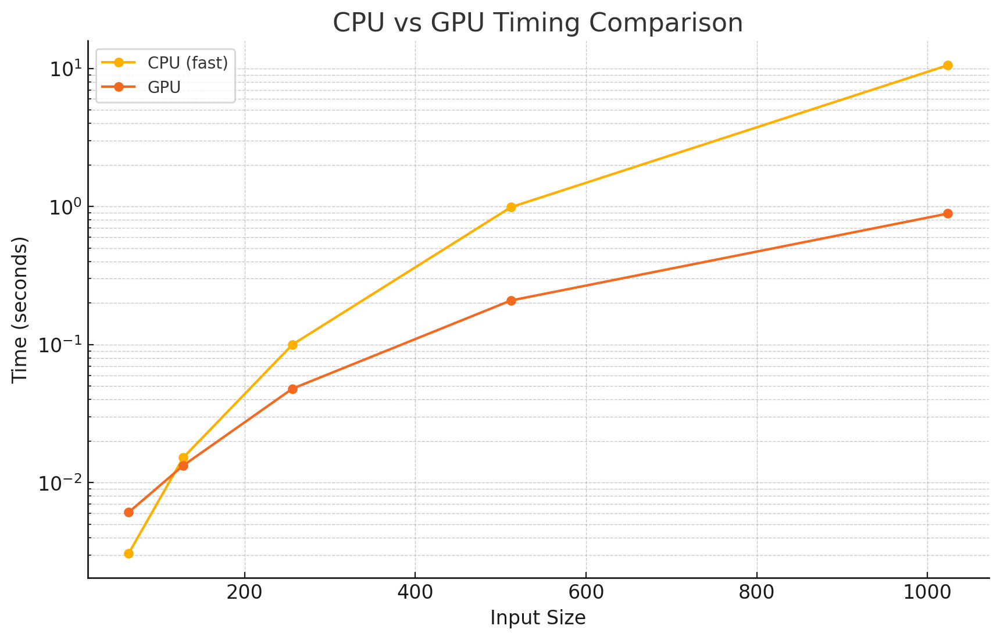

# MiniTorch Module 3


* Docs: https://minitorch.github.io/

* Overview: https://minitorch.github.io/module3.html


You will need to modify `tensor_functions.py` slightly in this assignment.

* Tests:

```
python run_tests.py
```

* Note:

Several of the tests for this assignment will only run if you are on a GPU machine and will not
run on github's test infrastructure. Please follow the instructions to setup up a colab machine
to run these tests.

This assignment requires the following files from the previous assignments. You can get these by running

```bash
python sync_previous_module.py previous-module-dir current-module-dir
```

The files that will be synced are:

        minitorch/tensor_data.py minitorch/tensor_functions.py minitorch/tensor_ops.py minitorch/operators.py minitorch/scalar.py minitorch/scalar_functions.py minitorch/module.py minitorch/autodiff.py minitorch/module.py project/run_manual.py project/run_scalar.py project/run_tensor.py minitorch/operators.py minitorch/module.py minitorch/autodiff.py minitorch/tensor.py minitorch/datasets.py minitorch/testing.py minitorch/optim.py

## 3.2: Parallel_check output
[View output here](output_files/parallel.txt)

## 3.4: GPU and CPU comparison
Timing summary
Size: 64
    fast: 0.00307
    gpu: 0.00610
Size: 128
    fast: 0.01520
    gpu: 0.01332
Size: 256
    fast: 0.10017
    gpu: 0.04800
Size: 512
    fast: 0.98971
    gpu: 0.20878
Size: 1024
    fast: 10.55691
    gpu: 0.88907




## 3.5
## GPU, Hidden 100
[Split: View output here](output_files/gpu/split_gpu_100.txt)  
[Xor: View output here](output_files/gpu/xor_gpu_100.txt)  
[Simple: View output here](output_files/gpu/simple_gpu_100.txt) 

## CPU, Hidden 100
[Split: View output here](output_files/cpu/split_cpu_100.txt) 
[Xor: View output here](output_files/cpu/xor_cpu_100.txt) 
[Simple: View output here](output_files/cpu/simple_cpu_100.txt) 


## Large GPU using Split
[View output here](output_files/large_gpu.txt) 


## Large GPU using Split
[View output here](output_files/large_cpu.txt) 


## 3.5 Documentation

```bash
def _mm_practice(out: Storage, a: Storage, b: Storage, size: int) -> None:
    """A practice square MM kernel to prepare for matmul.

    Given a storage `out` and two storage `a` and `b`. Where we know
    both are shape [size, size] with strides [size, 1].

    Size is always < 32.

    Requirements:

    * All data must be first moved to shared memory.
    * Only read each cell in `a` and `b` once.
    * Only write to global memory once per kernel.

    Compute

    ```
     for i:
         for j:
              for k:
                  out[i, j] += a[i, k] * b[k, j]
    ```

    Args:
    ----
        out (Storage): storage for `out` tensor.
        a (Storage): storage for `a` tensor.
        b (Storage): storage for `b` tensor.
        size (int): size of the square

    """
    BLOCK_DIM = 32
    # TODO: Implement for Task 3.3.
    # raise NotImplementedError("Need to implement for Task 3.3")

    # Shared memory for storing tiles of `a` and `b`
    a_shared = cuda.shared.array((BLOCK_DIM, BLOCK_DIM), numba.float64)
    b_shared = cuda.shared.array((BLOCK_DIM, BLOCK_DIM), numba.float64)

    # Get the thread's local position within the block (row and column indices).
    tx = cuda.threadIdx.x
    ty = cuda.threadIdx.y

    # Get the block's position in the grid.
    block_x = cuda.blockIdx.x
    block_y = cuda.blockIdx.y

    # Calculate the global row and column indices of the output matrix for this thread.
    row = block_x * BLOCK_DIM + tx
    col = block_y * BLOCK_DIM + ty

    # Initialize the output value for this thread
    temp = 0.0

    # Loop over all blocks of the shared dimension.
    # Each block corresponds to a tile of the input matrices `a` and `b`.
    for block in range((size + BLOCK_DIM - 1) // BLOCK_DIM):
        # Load a tile of matrix `a` into shared memory.
        if row < size and block * BLOCK_DIM + ty < size:
            a_shared[tx, ty] = a[row * size + block * BLOCK_DIM + ty]
        else:
            a_shared[tx, ty] = 0.0

        # Load a tile of matrix `b` into shared memory.
        if col < size and block * BLOCK_DIM + tx < size:
            b_shared[tx, ty] = b[(block * BLOCK_DIM + tx) * size + col]
        else:
            b_shared[tx, ty] = 0.0

        # Synchronize all threads to ensure the tile is fully loaded into shared memory
        cuda.syncthreads()

        # Compute the partial result for this block of `a` and `b`.
        for k in range(BLOCK_DIM):
            temp += a_shared[tx, k] * b_shared[k, ty]

        cuda.syncthreads()

    # Write the result to the output matrix
    if row < size and col < size:
        out[row * size + col] = temp
```

```bash
def _tensor_matrix_multiply(
    out: Storage,
    out_shape: Shape,
    out_strides: Strides,
    out_size: int,
    a_storage: Storage,
    a_shape: Shape,
    a_strides: Strides,
    b_storage: Storage,
    b_shape: Shape,
    b_strides: Strides,
) -> None:
    """CUDA tensor matrix multiply function.

    Requirements:

    * All data must be first moved to shared memory.
    * Only read each cell in `a` and `b` once.
    * Only write to global memory once per kernel.

    Should work for any tensor shapes that broadcast as long as ::

    ```python
    assert a_shape[-1] == b_shape[-2]
    ```
    Returns:
        None : Fills in `out`
    """
    a_batch_stride = a_strides[0] if a_shape[0] > 1 else 0
    b_batch_stride = b_strides[0] if b_shape[0] > 1 else 0
    # Batch dimension - fixed
    batch = cuda.blockIdx.z

    BLOCK_DIM = 32
    a_shared = cuda.shared.array((BLOCK_DIM, BLOCK_DIM), numba.float64)
    b_shared = cuda.shared.array((BLOCK_DIM, BLOCK_DIM), numba.float64)

    # The final position c[i, j]
    i = cuda.blockIdx.x * cuda.blockDim.x + cuda.threadIdx.x
    j = cuda.blockIdx.y * cuda.blockDim.y + cuda.threadIdx.y

    # The local position in the block.
    pi = cuda.threadIdx.x
    pj = cuda.threadIdx.y

    # Code Plan:
    # 1) Move across shared dimension by block dim.
    #    a) Copy into shared memory for a matrix.
    #    b) Copy into shared memory for b matrix
    #    c) Compute the dot produce for position c[i, j]
    # TODO: Implement for Task 3.4.
    # raise NotImplementedError("Need to implement for Task 3.4")

    # Initialize the output value for this thread
    temp = 0.0

    # Iterate over tiles of the shared dimension
    for block in range((a_shape[-1] + BLOCK_DIM - 1) // BLOCK_DIM):
        # Load a tile of matrix `a` into shared memory
        if i < a_shape[-2] and block * BLOCK_DIM + pj < a_shape[-1]:
            a_shared[pi, pj] = a_storage[
                batch * a_batch_stride
                + i * a_strides[-2]
                + (block * BLOCK_DIM + pj) * a_strides[-1]
            ]
        else:
            a_shared[pi, pj] = 0.0  # Padding with zeros if out of bounds

        # Load a tile of matrix `b` into shared memory
        if j < b_shape[-1] and block * BLOCK_DIM + pi < b_shape[-2]:
            b_shared[pi, pj] = b_storage[
                batch * b_batch_stride
                + (block * BLOCK_DIM + pi) * b_strides[-2]
                + j * b_strides[-1]
            ]
        else:
            b_shared[pi, pj] = 0.0  # Padding with zeros if out of bounds

        # Synchronize threads
        cuda.syncthreads()

        # Compute the partial dot product for this thread
        for k in range(BLOCK_DIM):
            temp += a_shared[pi, k] * b_shared[k, pj]

        # Synchronize threads to ensure computations are completed before the next tile
        cuda.syncthreads()

    # Write the computed value to the output matrix
    if i < out_shape[-2] and j < out_shape[-1]:
        out[batch * out_strides[0] + i * out_strides[-2] + j * out_strides[-1]] = temp

```